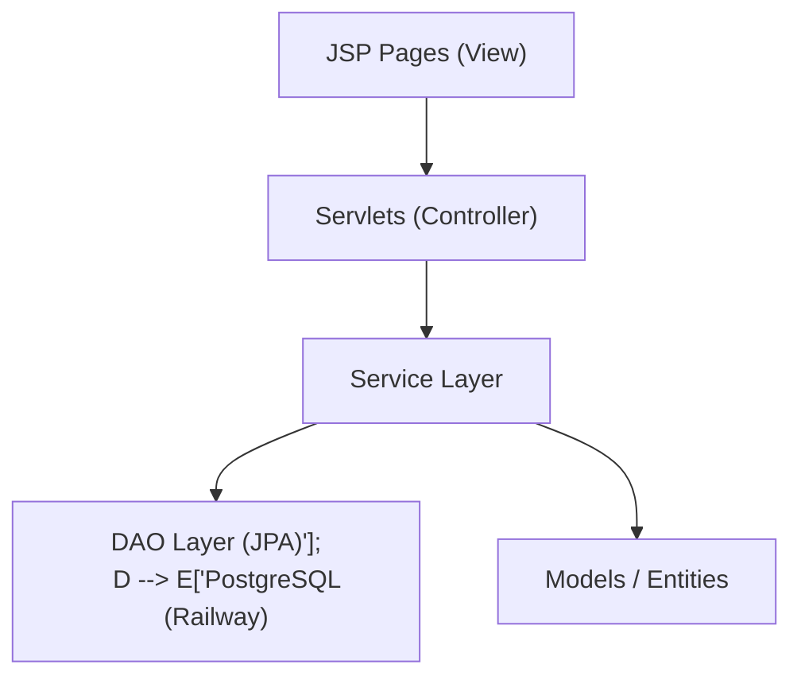

<p align="center">  </p>

<h1 align="center">🚗 Joe Detailing – Premium Car Wash Web App</h1> <p align="center">A premium JSP + Servlet web application for managing car detailing services, memberships, and client bookings.</p>

<p align="center"> <a href="https://joe-detailing.up.railway.app">  </a> </p>

## Badges

<!-- Language & Tech -->


<!-- Build & Tooling -->


<!-- Project Info -->


<!-- Environment -->


## 📌Overview

Joe Detailing is a fully-functional full-stack web application designed for professional car detailing businesses. It streamlines the process of booking services, managing user memberships, and tracking administrative tasks.

The app follows a professional MVC architecture and includes: ✔ Secure User Authentication using BCrypt hashing.


✔ Multi-package service booking system.


✔ Tiered Membership system (Basic to Premium).


✔ Admin Dashboard for real-time service tracking.


✔ Persistent data management via Hibernate/JPA.


✔ Modern, premium-themed responsive UI.

## ⚙️ Features

### 🔐 Secure Authentication
- Multi-role support for ADMIN and USER accounts.

- Advanced password security with jBCrypt encryption.

- Authorization filters to protect private routes.

### 🛠️ Booking Management
- Choose from five specialized wash packages: Basic, Deluxe, Premium, Ultimate, and Dry Cleaning.

- Automated status tracking from Confirmed to Completed.

- Personal booking history dashboard for all users.

### 👔 Admin Controls
- Centralized dashboard to view every client appointment.

- One-click completion logic to update service records.

### 🎨 Premium UI/UX
- Aesthetic styling with custom CSS transitions.

- Interactive navigation bar with mobile-friendly hamburger menu.


## 🏗️ Technologies Used

| Layer    | Technologies                 |
| -------- | ---------------------------- |
| Frontend |HTML5, CSS3, JavaScript, JSP              |
| Backend  | Java 17, Servlets, Service Layer|
|Database | PostgreSQL, Hibernate 5.6 (JPA)     |
| Build    | Maven                        |
| Server   | Apache Tomcat 9           |


## 🧩 Architecture Diagram (Mermaid)



## Project Structure

```
src/
└── main/
    ├── java/
    │   └── com.github.joel003.cardetailingapp/
    │       ├── controller/  # Web Request Handlers
    │       ├── service/     # Core Business Logic
    │       ├── dao/         # Data Access Layer
    │       ├── model/       # Database Entities & Enums
    │       ├── util/        # JPA Setup (JPAUtil) & Validators
    │       └── exception/   # Custom Error Classes
    │
    ├── resources/
    │   └── META-INF/
    │       └── persistence.xml  # Hibernate Settings
    │
    └── webapp/
        ├── css/             # Custom Aesthetics
        ├── js/              # Client-side Logic
        ├── assets/          # Brand Icons & Images
        └── *.jsp            # Dynamic Web Pages

└── test/
    └── java/
        ├── BMIAdultServiceTest.java
        ├── BMRServiceTest.java
        └── InputValidatorTest.java

```

## 🚀 Installation & Setup

### 1️⃣ Clone the repository
```bash
git clone https://github.com/joel-003/car-detailing-app.git
cd car-detailing-app
```

### 2️⃣ Configure Credentials

Set these environment variables in your local IDE or server:

- JDBC_URL: jdbc:postgresql://your-db-host:port/dbname

- DB_USER: your-username

- DB_PASSWORD: your-password

### 3️⃣ Build and Run
```
mvn clean package -DskipTests
```
- Deploy the target/ROOT.war file to your Tomcat webapps/ folder.

## ▶️ Main Servlet Endpoints

| Feature      | Servlet         | URL                |
| -------------| --------------- | -------------------|
| Registration | RegisterServlet | `/register`        |
| Login        | LoginServlet    | `/login`           |
| Booking      | BookingServlet  | `/booking`         |
| Booking      | BookingServlet  | `/admin/dashboard` |

## 📸 CLI Screenshots

Click below to view all screenshots:

👉 [Open Screenshots Folder](BMI-Health-App-Screenshot/)

## 🛡️ Exception Handling
- Custom InvalidInputException for robust data entry checks.

- Centralized InputValidator for email formats and numeric safety.

- Static JPAUtil initializer with safe EntityManagerFactory handling.

## 🔮 Future Enhancements

* Integrated Payment Gateway (Stripe/PayPal)

- Email notification for booking confirmations

- Dark Mode toggle for the UI

- Customer review and rating system

## License

This project is licensed under the **MIT License**.

See the [LICENSE](LICENSE) file for full details.

